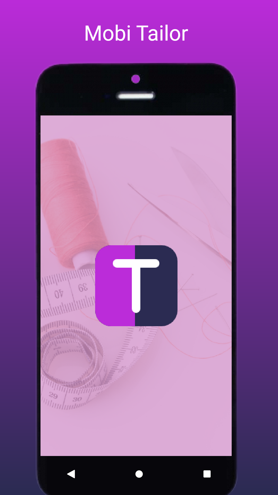
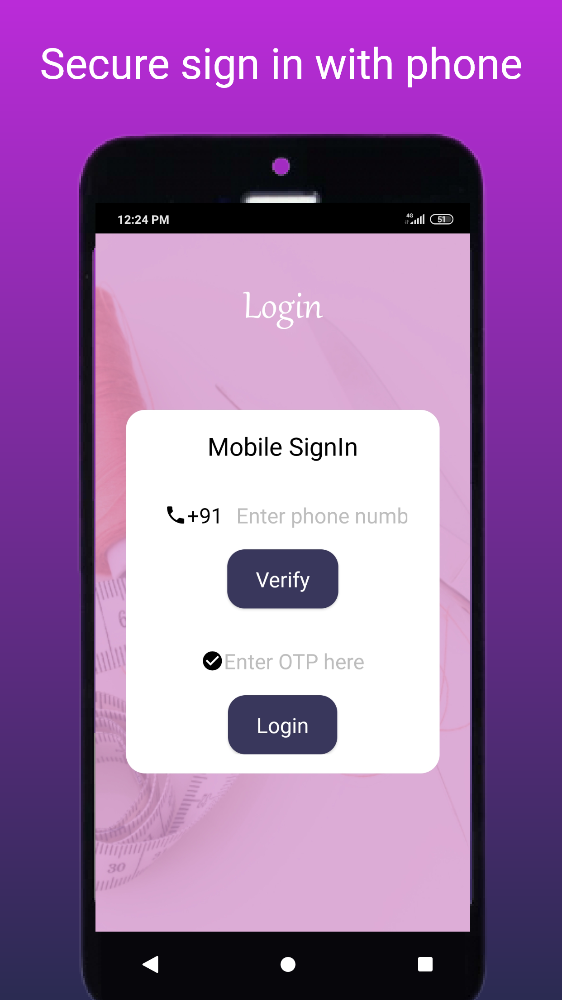
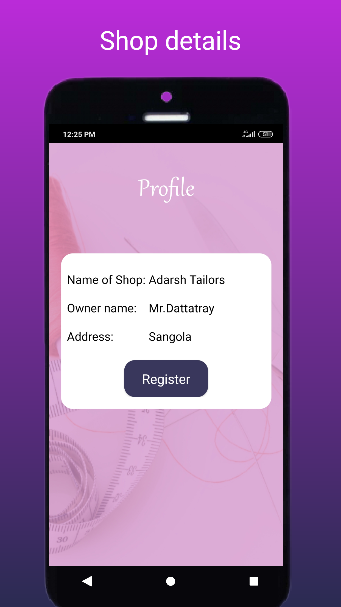
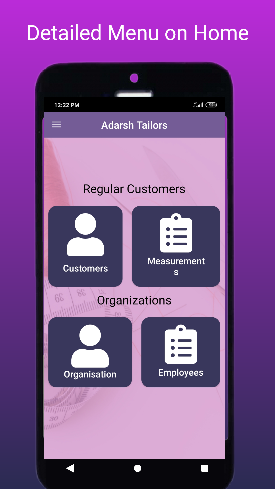
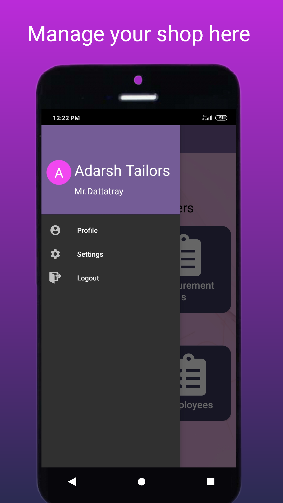
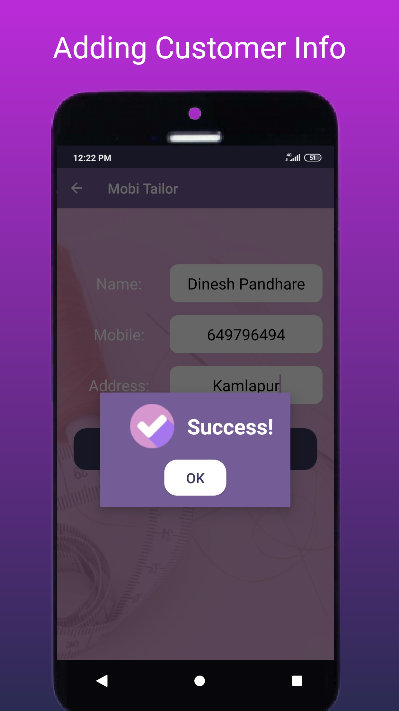
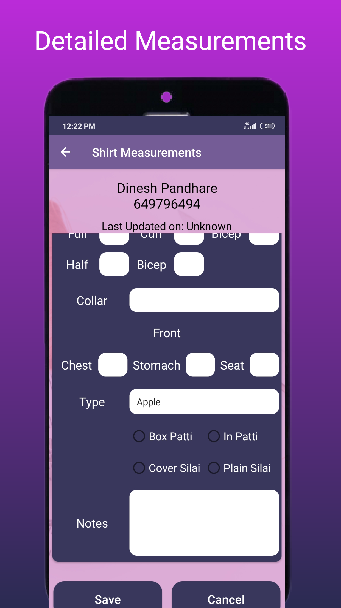
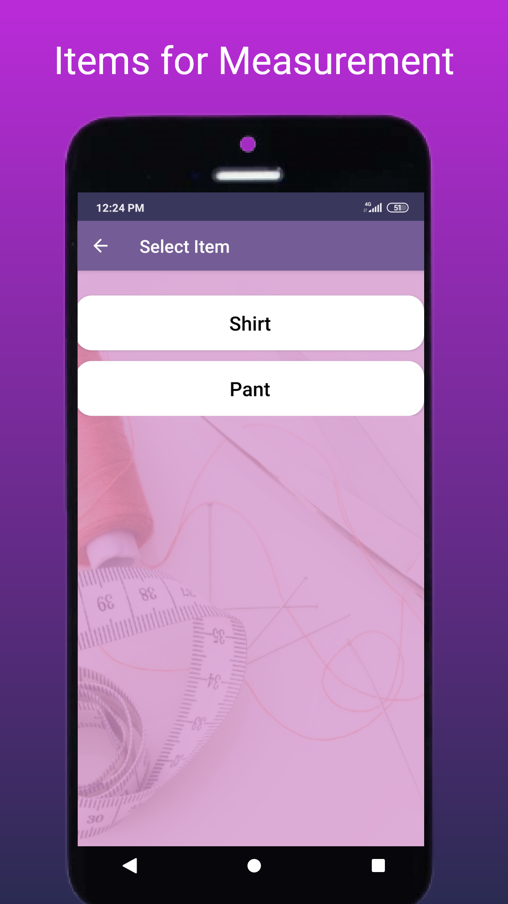

# Mobi Tailor Android App

<h2 style="">Description</h2>

<b>MobiTailor</b> is an Android app created in Java. It is developed to solve the problems of Tailoring Shop Owners. Shop Owners can manage their Customers along with their Measurements and Billing, etc.

___
## USP
##### App comes with build in Cloud Storage support. So you never lose your data! Never!
##### Secured with direct Phone Sign In (OTP authentication)
##### In demand technologies like Firebase Realtime Database & Firebase Authentication are used.
___

## Contact me:
Portfolio Website: [adarsh45.github.io](https://adarsh45.github.io)
Email: [shete.adarsh@gmail.com](shete.adarsh@gmail.com)
LinkedIn: [linkedin.com/adarsh45](https://www.linkedin.com/in/adarsh45/)